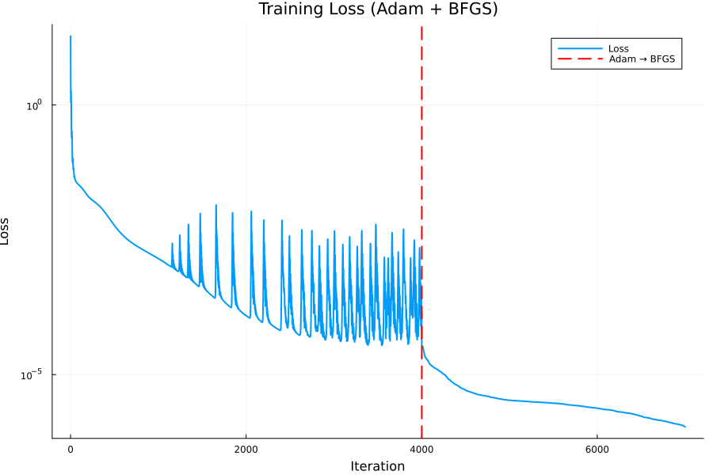
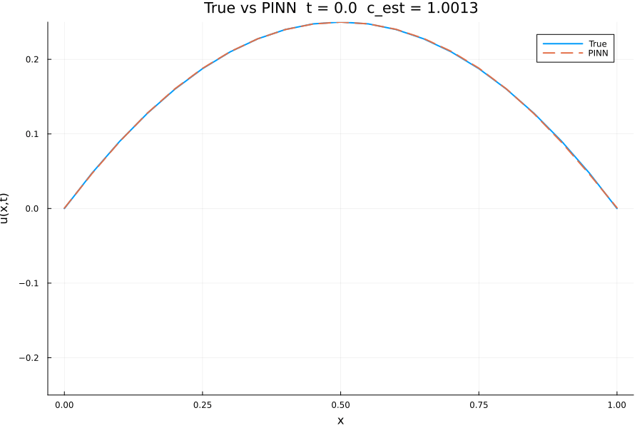
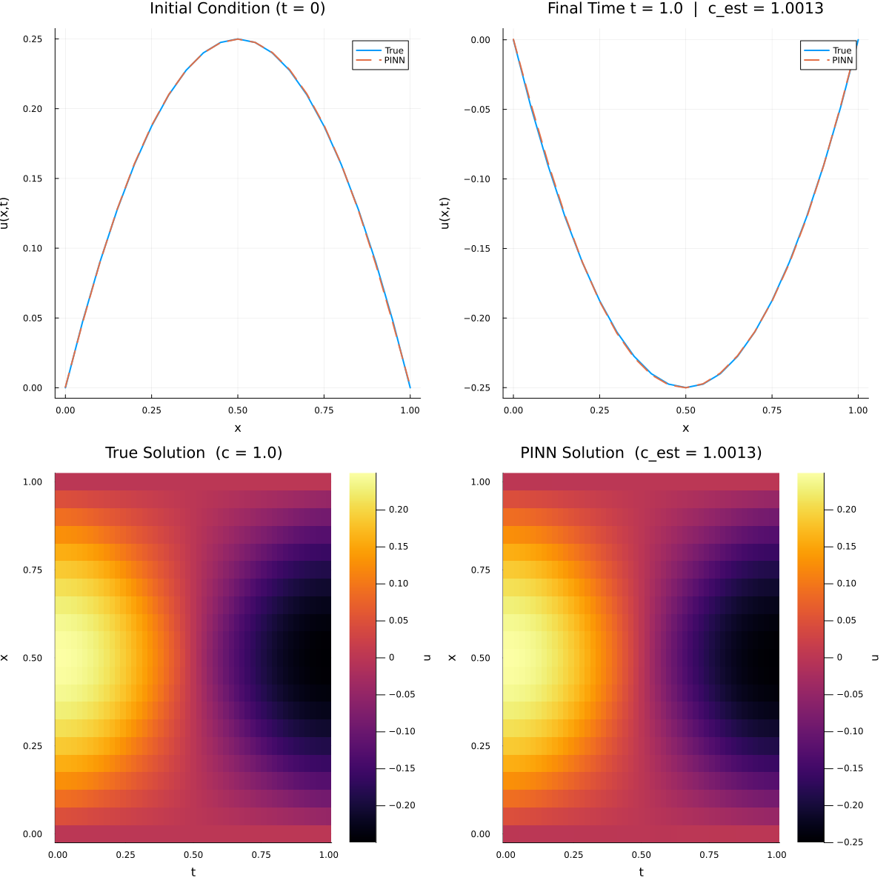

# 🌊 1D Wave Equation PINN — Inverse Wave Speed Estimation

## 📊 Status Badges

| Badge | Status |
|-------|--------|
| **CI Pipeline** | [](https://github.com/digvijay1992/inverse-prob-pinn/actions/workflows/ci.yml) |
| **Julia Version** | [](https://julialang.org/) |
| **License** | [](https://opensource.org/licenses/MIT) |
| **Last Commit** |  |
| **Code Size** |  |
| **Open Issues** |  |

[](https://github.com/digvijay1992/inverse-prob-pinn/stargazers)  
[](https://github.com/digvijay1992/inverse-prob-pinn/network/members)  
[](https://github.com/digvijay1992/inverse-prob-pinn/watchers)

> A Physics-Informed Neural Network (PINN) formulation of the **1D wave equation inverse problem**, where the network jointly learns the solution $u(x,t)$ and the unknown wave speed $c$ from sparse sensor data and PDE constraints.

## 📌 Table of Contents

- [🌊 1D Wave Equation PINN — Inverse Wave Speed Estimation](#-1d-wave-equation-pinn--inverse-wave-speed-estimation)
  - [📊 Status Badges](#-status-badges)
  - [📌 Table of Contents](#-table-of-contents)
  - [📖 Overview](#-overview)
  - [🧮 Problem Setup](#-problem-setup)
    - [Forward Model](#forward-model)
    - [Boundary and Initial Conditions](#boundary-and-initial-conditions)
    - [Synthetic Sensor Data](#synthetic-sensor-data)
  - [🧠 PINN Architecture & Parameter Estimation](#-pinn-architecture--parameter-estimation)
  - [📊 Error Metrics & Wave-Speed Convergence](#-error-metrics--wave-speed-convergence)
  - [📈 Visualization](#-visualization)
  - [🛠️ Installation](#️-installation)
    - [Clone the repository](#clone-the-repository)
    - [Set up the Julia environment](#set-up-the-julia-environment)
  - [🚀 Usage](#-usage)
  - [📊 Parameters](#-parameters)
    - [Physical and Numerical Parameters](#physical-and-numerical-parameters)
    - [PINN & Training Hyperparameters](#pinn--training-hyperparameters)
  - [📚 Theoretical Background](#-theoretical-background)
  - [📄 License](#-license)
  - [👤 Author](#-author)

## 📖 Overview

This project considers the **inverse problem** for the 1D wave equation: given sparse space–time measurements of the displacement field $u(x,t)$, we aim to recover an unknown wave speed $c$ together with a smooth approximation of the solution. The approach combines **NeuralPDE**, **Lux**, and the **Optimization** ecosystem to implement a PINN with **parameter estimation** (`param_estim = true`) for the PDE coefficient.

  
  


The experiment demonstrates:

- Joint learning of state $u(x,t)$ and parameter $c$ using PDE residuals, boundary/initial conditions, and sensor data.
- Robust training via a two‑phase **Adam → BFGS** schedule.
- Detailed diagnostics for loss evolution and convergence of the estimated wave speed $c_{\text{est}}$ toward $c_{\text{true}} = 1.0$.

## 🧮 Problem Setup

### Forward Model

We study the 1D wave equation on $x \in [0,1]$, $t \in [0,T]$:

$$
u_{tt}(x,t) = c^2 u_{xx}(x,t),
$$

with a true wave speed $c_{\text{true}} = 1.0$ used for synthetic data generation.

### Boundary and Initial Conditions

The physical setup is identical to your forward PINN case.

- Boundary conditions:
  - $u(0,t) = 0$
  - $u(1,t) = 0$

- Initial conditions:
  - $u(x,0) = x(1 - x)$
  - $u_t(x,0) = 0$

The analytical solution again uses a Fourier sine series expansion:

$$
u(x,t) = \sum_{n=1}^{N} a_n \cos(c n \pi t)\,\sin(n \pi x),
$$

with $a_n = \dfrac{8}{\pi^3 n^3}$ for odd $n$ and zero for even $n$, evaluated up to $N = 200$ modes.

### Synthetic Sensor Data

Instead of fully observing the field, we sample **nine sensor points** at:

- Spatial locations: $x \in \{0.25, 0.5, 0.75\}$.
- Times: $t \in \{0.2, 0.5, 0.8\}$.

The script constructs:

- `measure_points`: all $(x,t)$ combinations.
- `u_meas`: true displacement at each point using $c_{\text{true}}$.
- `sensor_input`: a $2 \times 9$ matrix of inputs for batched PINN evaluation.
- `sensor_target`: a $1 \times 9$ matrix of measured outputs.

These measurements drive an additional data‑misfit term in the PINN loss.

## 🧠 PINN Architecture & Parameter Estimation

The PINN structure is similar to the forward case but augmented for **parameter learning**:

- Network architecture (`Lux.Chain`):

  - Input: 2 ($x, t$).
  - Hidden layers: 3.
  - Hidden units: 32 per layer.
  - Activation: plain `tanh` for all hidden layers.
  - Output: 1 (scalar displacement $u(x,t)$).

- PDE system and parameter:

  - Symbolic parameters: `@parameters x t c_param`.
  - PDE residual: `Dtt(u(x,t)) ~ c_param^2 * Dxx(u(x,t))`.
  - `PDESystem(..., [c_param]; initial_conditions = Dict([c_param => 0.5]))` seeds the initial guess $c_{\text{est}}^{(0)} = 0.5$.

- PINN discretization (NeuralPDE):

  - Training strategy: `GridTraining(dx_train)` with `dx_train = 0.02` for dense collocation.
  - `PhysicsInformedNN` is called with:
    - `chains` and `init_params` wrapped in vectors (required for `param_estim = true`).
    - `param_estim = true` to treat `c_param` as a learnable parameter.
    - `additional_loss = data_loss` to incorporate sensor data.

- Sensor data loss:

  - `data_loss(phi, θ, p)` compares network predictions at `sensor_input` to `sensor_target`, normalized by the number of measurements.
  - With `param_estim = true`, NeuralPDE passes `θ.u` as network weights and `p[1]` as the current $c$ estimate.

- Optimization schedule:

  - Phase 1: **Adam** with learning rate 0.01, 4000 iterations.
  - Phase 2: **BFGS** (from `OptimizationOptimJL`) with line search, 3000 iterations initialized from the Adam result.
  - A custom callback (`make_cb`) records:
    - Training loss (`loss_history`).
    - Training phase label (`phase_history`).
    - Wave‑speed estimate (`c_history` via `current_c(u) = u.p[1]`).

This design allows detailed tracking of how $c_{\text{est}}$ moves toward $c_{\text{true}}$ during both optimizer phases.

## 📊 Error Metrics & Wave-Speed Convergence

After training, the script evaluates the learned solution on an independent grid:

- Evaluation grid:
  - `x_vals = 0.0:dx_eval:1.0` with `dx_eval = 0.05`.
  - `t_vals = 0.0:dt_eval:Tfinal` with `dt_eval = 0.02`.

- Fields:
  - `U_true` from the analytical solution with $c_{\text{true}}$.
  - `U_pinn` from the PINN using the final parameter estimate.
  - `Err = abs.(U_pinn .- U_true)` as the absolute error field.

- Global metrics:
  - Mean absolute error (MAE).
  - Root-mean-square error (RMSE).
  - Maximum absolute error over the grid.

The script also reports wave‑speed convergence:

- `c_history` versus iteration, plotted in `inverse_c_convergence.png` with the true value $c_{\text{true}} = 1.0$ as a horizontal reference line.
- Loss curve over iterations (Adam + BFGS) in `inverse_c_loss_history.png`, with a dashed vertical line marking the optimizer switch.

## 📈 Visualization

Multiple static figures and animations are generated for analysis and presentations.

- Static PNGs:
  - `inverse_c_wave_pinn_comparison.png`: 2×2 panel showing:
    - Initial condition comparison at $t = 0$.
    - Final‑time comparison at $t = 1.0$ with annotated $c_{\text{est}}$.
    - Heatmap of true solution.
    - Heatmap of PINN solution with estimated $c$.
  - `inverse_c_initial_condition.png`: line plot of true vs PINN at $t = 0$.
  - `inverse_c_finaltime.png`: line plot at final time.
  - `inverse_c_true_heatmap.png` and `inverse_c_pinn_heatmap.png`: separate heatmaps for true and learned fields.
  - `inverse_c_loss_history.png`: training loss evolution with Adam/BFGS split.
  - `inverse_c_convergence.png`: estimated vs true wave speed over iterations.

- GIFs:
  - `inverse_c_pinn_vs_true.gif`: animated line plots showing true vs PINN over time.
  - `inverse_c_heatmap_animation.gif`: animated heatmaps of true and PINN solutions over the time horizon.

- Data files:
  - `inverse_c_wave_pinn_simulation.jld2`: structured JLD2 dataset with grids and solution fields.
  - `inverse_c_wave_pinn_simulation.csv`: flat table containing $(x,t,u_{\text{true}},u_{\text{pinn}},\text{error})$ for external post‑processing.

These outputs make the repository a self‑contained reference for inverse PINN experiments.

## 🛠️ Installation

### Clone the repository

```bash
git clone https://github.com/digvijay1992/inverse-prob-pinn.git
cd inverse-prob-pinn
```

### Set up the Julia environment

From the repository root, open Julia and activate/instantiate:

```julia
using Pkg
Pkg.activate(".")
Pkg.instantiate()
```

Dependency versions are encoded in `Project.toml`; the main packages include `NeuralPDE`, `Lux`, `ModelingToolkit`, `Optimization`, `OptimizationOptimisers`, `OptimizationOptimJL`, `Plots`, `ComponentArrays`, `JLD2`, `CSV`, `Tables`, `DomainSets`, `Statistics`, `StatsBase`, and `Zygote`.

## 🚀 Usage

Run the inverse problem script from the repository root:

```bash
julia inverse_prob_pinn.jl
```

This will:

- Generate synthetic sensor data using the analytical solution with $c_{\text{true}} = 1.0$.
- Define the PDE with a trainable parameter `c_param` and set the initial guess $c_{\text{est}}^{(0)} = 0.5$.
- Build the PINN with grid‑based collocation, parameter estimation, and an additional sensor‑data loss.
- Train with Adam followed by BFGS, recording loss, optimizer phase, and wave‑speed estimate.
- Evaluate the learned solution on an independent grid and compute error metrics.
- Generate all static plots, GIFs, and data files listed above.

## 📊 Parameters

### Physical and Numerical Parameters

| Parameter | Symbol | Default | Description |
|----------|--------|---------|-------------|
| True wave speed | $c_{\text{true}}$ | 1.0 | Ground‑truth speed used for sensor data. |
| Final time | $T_{\text{final}}$ | 1.0 | End of simulation interval. |
| Collocation spacing | `dx_train` | 0.02 | Grid spacing for PINN training. |
| Evaluation spacing | `dx_eval` | 0.05 | Spatial spacing for evaluation grid. |
| Time step (eval) | `dt_eval` | 0.02 | Temporal spacing for evaluation grid. |
| Fourier modes | $N_{\text{fourier}}$ | 200 | Modes in analytical series. |
| Random seed | `seed` | 1234 | Reproducible initialization and sampling. |

### PINN & Training Hyperparameters

| Component | Value | Description |
|----------|-------|-------------|
| Hidden layers | 3 | Depth of Lux network. |
| Hidden units | 32 | Neurons per hidden layer. |
| Activation | `tanh` | Nonlinearity for all hidden layers. |
| Output | 1 | Scalar displacement $u(x,t)$. |
| Parameter estimation | `param_estim = true` | Treats `c_param` as trainable. |
| Initial $c$ guess | `c_param = 0.5` | Seed for inverse problem. |
| Optimizer (phase 1) | Adam | LR 0.01, 4000 iterations. |
| Optimizer (phase 2) | BFGS | 3000 iterations, initialized from Adam. |

## 📚 Theoretical Background

Inverse problems for PDEs seek to identify unknown coefficients or source terms from limited observations of the state variable. PINNs offer a natural framework for such problems by embedding the PDE, boundary/initial conditions, and measurement data into a single loss function optimized over network weights and parameters.

In this example:

- The PDE residual enforces **physics consistency** for the candidate $u(x,t)$ and $c$.
- Sensor data provide **localized constraints** that guide $c_{\text{est}}$ toward $c_{\text{true}}$.
- The optimization traces a trajectory where both the field and coefficient become increasingly compatible with measurements and the wave equation.

This repository thus serves as a compact template for **coefficient‑identification PINNs** in hyperbolic PDEs, extendable to more complex geometries and multi‑parameter inference.

## 📄 License

This project is licensed under the **MIT License**. See the `LICENSE` file for details.

## 👤 Author

**Digvijay Singh**

- GitHub: [@digvijay1992](https://github.com/digvijay1992)
- Areas: CFD, multiphase flow, scientific machine learning, PINNs, inverse problems, and Julia‑based surrogate modeling.
